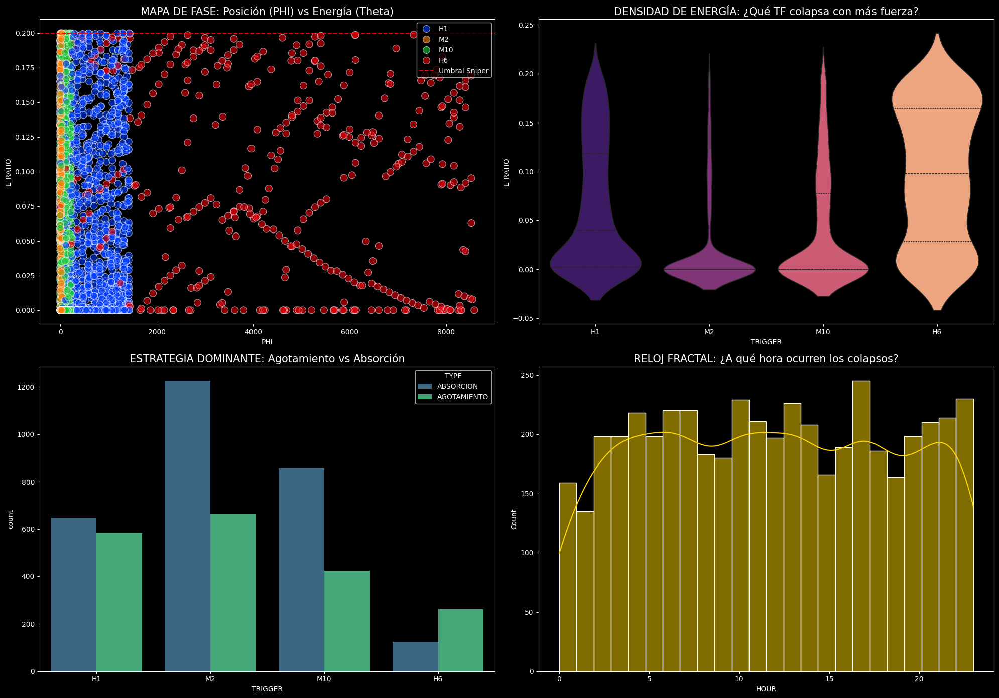

# 🔱 ARC: Augmented Resonance & Cyclic Analysis
## 🛰️ Quantitative Trading Framework for Synthetic Indices

Este repositorio representa la culminación de más de 4 años de investigación en **Física de Mercados Fractales** y **Mallas de Resonancia Cíclica**, originalmente desarrollados en Google Colab para los índices sintéticos de Deriv (específicamente **Boom 1000**).

La arquitectura ARC no es un sistema de indicadores tradicionales; es un **Campo Discretizado** que mapea la partícula de precio dentro de una **Malla de 144 Nodos**, analizando su energía cinética y tensión superficial en tiempo real.

---

### 🧠 Arquitectura Core (Axiomas de la Tesis)

1.  **Discretización Nodal (Malla 1/144):** Espacio vertical del canal de regresión dividido en 144 estados discretos. El **Nodo 81** actúa como el centro de masa (Muro Principal).
2.  **Confluencia Pentagonal:** Análisis sincronizado en 5 dimensiones temporales (**M2, M10, H1, H6, H12**).
3.  **Física de la Ignición:** El sistema detecta la "Ignición" mediante la relación entre la Energía del Ticks ($\Delta P/\Delta t$) y el *Noise Floor* adaptativo.
4.  **Tensión Fractal ($\Upsilon$ - Upsilon):** Métrica de varianza que mide la saturación de la malla antes de una ruptura inminente.

---

---

### 📂 Estructura del Portafolio

Este laboratorio ha sido recuperado y profesionalizado en 12 módulos de investigación, organizados en 4 pilares:

| Pilar | Descripción | Acceso |
|-------|-------------|--------|
| **01 Market Physics** | Fundamentos, Nodos y Tensión $\Upsilon$ | [Abrir Carpeta](./Mis_EAs_Colab/01_Market_Physics/) |
| **02 Execution Zones** | Zonas de Ignición y Zona Gloria | [Abrir Carpeta](./Mis_EAs_Colab/02_Execution_Zones/) |
| **03 Big Data Auditor** | Minería Masiva (15.3M registros) e Invarianza | [Abrir Carpeta](./Mis_EAs_Colab/03_BigData_Auditor/) |
| **04 Signal Intelligence** | ADN de Señales y Auditoría Forense | [Abrir Carpeta](./Mis_EAs_Colab/04_Signal_Intelligence/) |

---

### 🖼️ Resultados Visuales Destacados

#### Análisis de Resonancia (Master Analyzer)

#### Auditoría de Confluencia de Ignición

---

### 📊 Hallazgos Estadísticos Clave
*   **Zona Gloria (Nodos 72-82):** Se identificó una densidad de ignición positiva del **26.1%** concentrada en el Nodo 81.
*   **Firma de Ignición:** Los eventos de éxito presentan una Energía Promedio de **21,411** vs. **745** en fallos estériles.
*   **Invarianza Estructural:** El sistema demostró ser robusto ante cambios de régimen de volatilidad (2021 vs 2024).

---

### 📘 Teoría de Respaldo
El fundamento matemático completo se detalla en el [ARC Theory White Paper](./Mis_EAs_Colab/ARC_THEORY_WHITE_PAPER.md).

---

### 🛠️ Tecnología Utilizada
*   **Lenguajes:** Python (Data Science) y MQL5 (Malla Titanium).
*   **Herramientas:** Pandas, Scikit-Learn, MetaTrader 5 Expert Advisors.

---
> **"El mercado es un sistema de memoria estructurada, no un campo de probabilidad uniforme."**  
> *— Tesis ARC v4.1*
